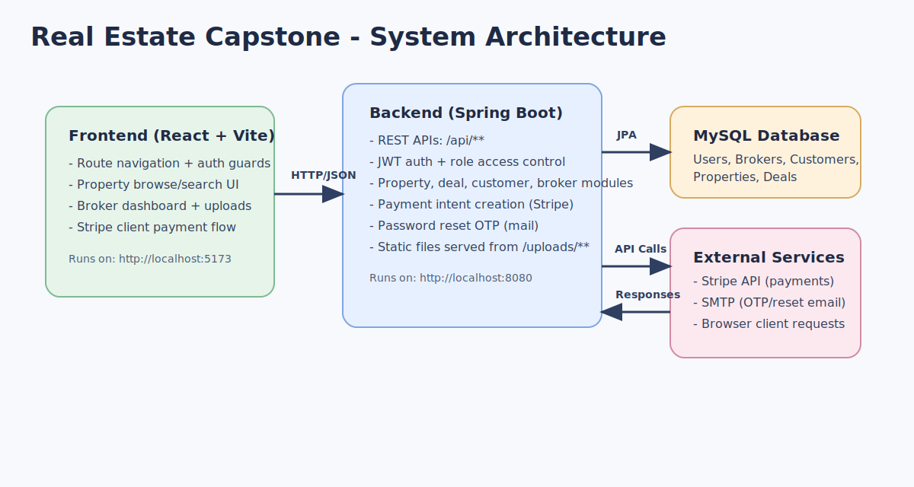
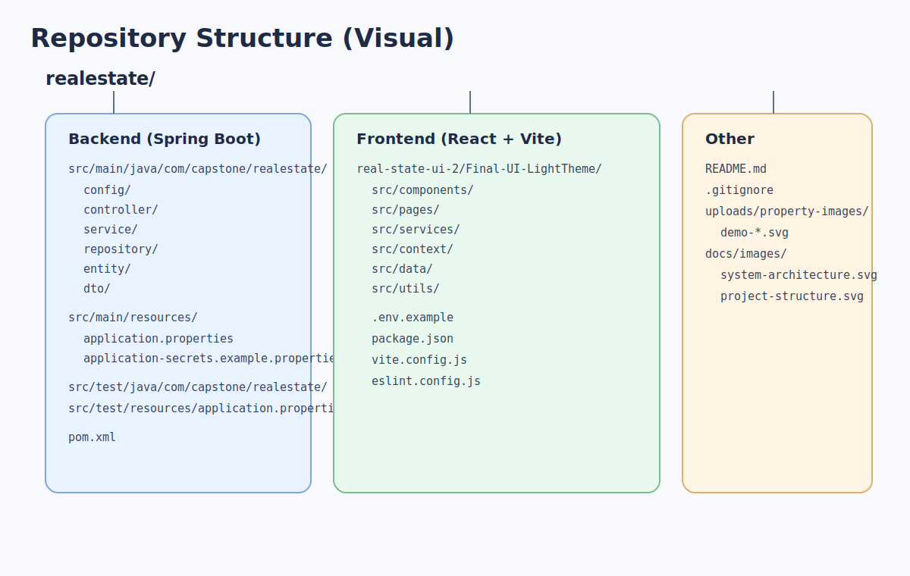
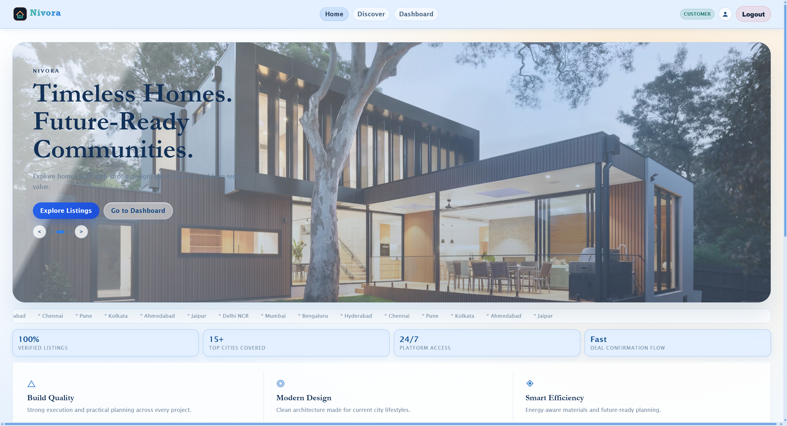
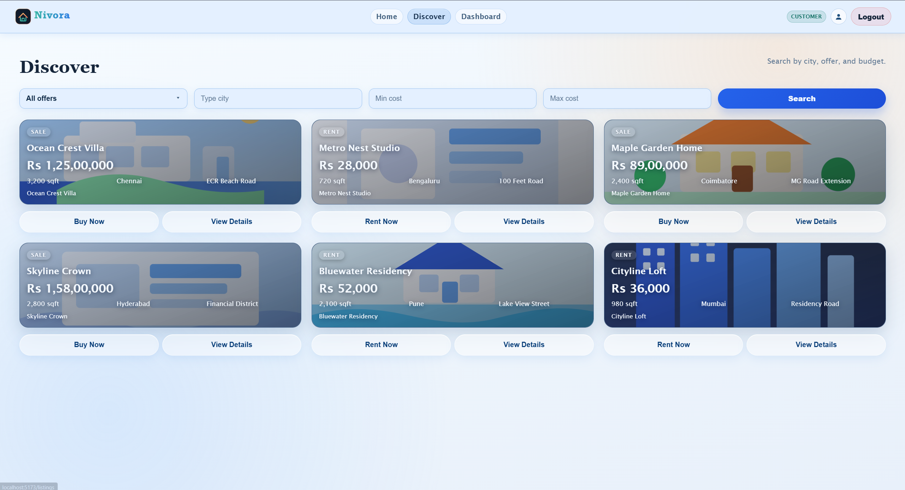
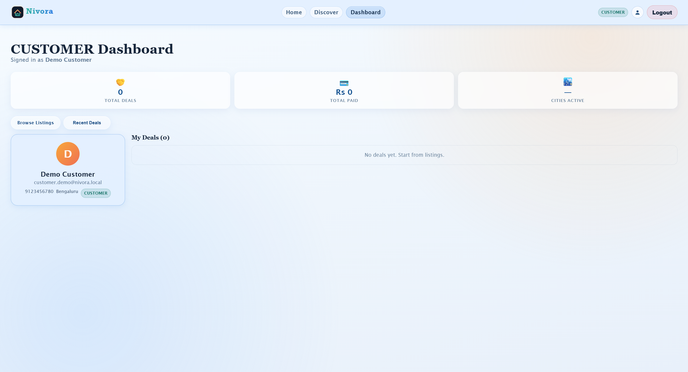
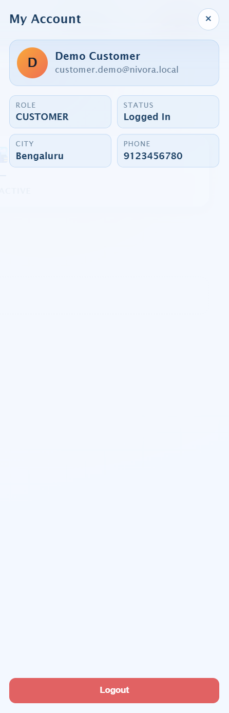
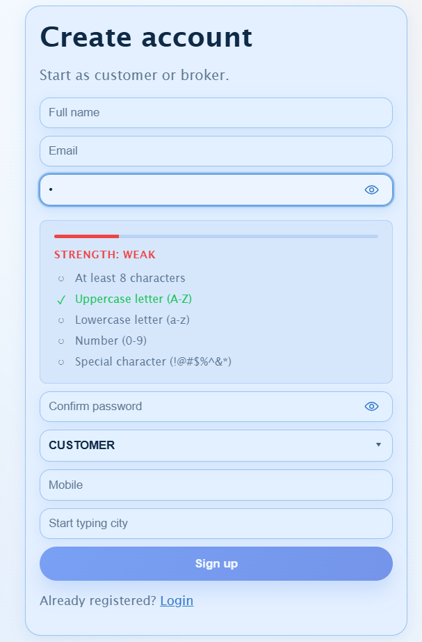
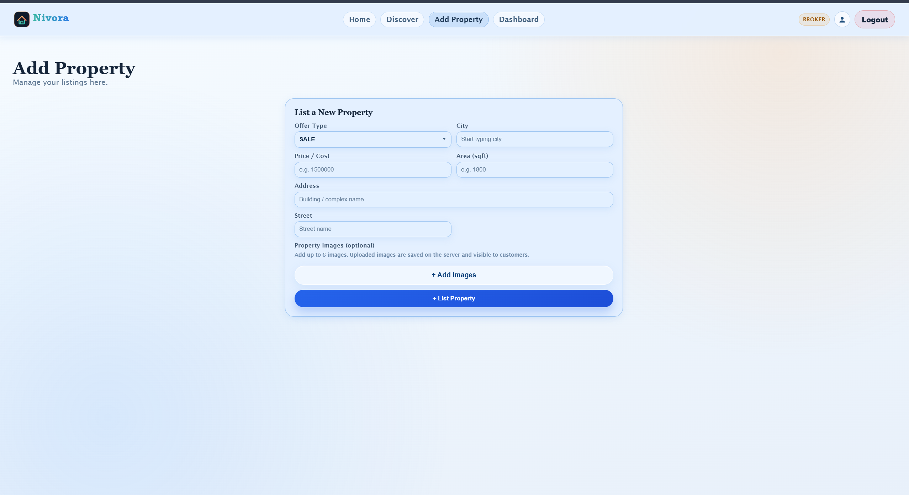
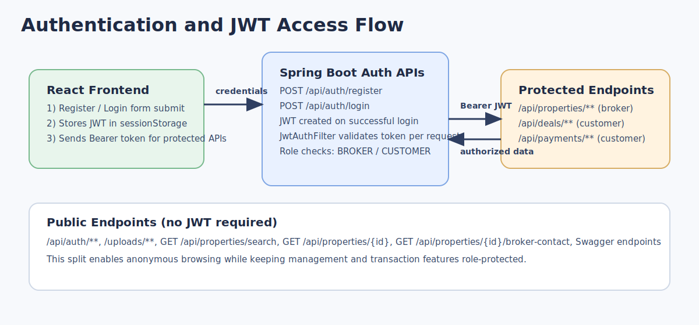
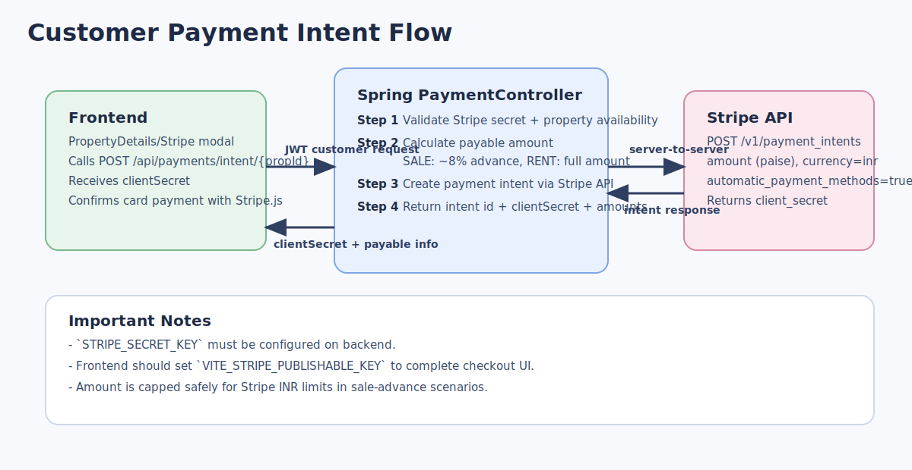

# Real Estate Capstone Project

Full-stack real estate platform with a Spring Boot backend and a React + Vite frontend. The application supports broker/customer authentication, property management, listing search, deal creation, image uploads, OTP-based password reset, and Stripe payment intent generation.

## Table Of Contents

1. [Tech Stack](#tech-stack)
2. [Architecture Overview](#architecture-overview)
3. [System Architecture Diagram](#system-architecture-diagram)
4. [Repository Structure](#repository-structure)
5. [Project Structure Diagram](#project-structure-diagram)
6. [UI Screenshots](#ui-screenshots)
7. [Prerequisites](#prerequisites)
8. [Backend Setup (Spring Boot)](#backend-setup-spring-boot)
9. [Frontend Setup (React + Vite)](#frontend-setup-react--vite)
10. [Run The Full App](#run-the-full-app)
11. [Configuration Reference](#configuration-reference)
12. [Authentication And Roles](#authentication-and-roles)
13. [Auth JWT Flow Diagram](#auth-jwt-flow-diagram)
14. [API Overview](#api-overview)
15. [Payment Intent Flow Diagram](#payment-intent-flow-diagram)
16. [Swagger/OpenAPI](#swaggeropenapi)
17. [Demo Data](#demo-data)
18. [File Uploads And Static Resources](#file-uploads-and-static-resources)
19. [Testing](#testing)
20. [Troubleshooting](#troubleshooting)
21. [Security And Secrets](#security-and-secrets)
22. [GitHub Submission Checklist](#github-submission-checklist)

## Tech Stack

### Backend

- Java 17
- Spring Boot 3.2
- Spring Security (JWT-based auth)
- Spring Data JPA + Hibernate
- MySQL (runtime)
- H2 (tests)
- Spring Mail (OTP reset workflow)
- Springdoc OpenAPI (Swagger UI)

### Frontend

- React 19
- Vite 8
- React Router
- Stripe.js + React Stripe
- Framer Motion + GSAP

## Architecture Overview

- Backend exposes REST APIs under `/api/**`.
- Frontend consumes APIs via `VITE_API_BASE_URL`.
- JWT token is issued on login and sent as `Authorization: Bearer <token>` for protected endpoints.
- Uploaded property images are stored on local disk under `uploads/` and exposed through `/uploads/**`.
- Optional demo seeding creates demo users and listings for instant reviewer testing.

## System Architecture Diagram



## Repository Structure

```text
.
|-- pom.xml
|-- src/
|   |-- main/java/com/capstone/realestate/
|   |-- main/resources/
|   |-- test/java/com/capstone/realestate/
|   `-- test/resources/
|-- real-state-ui-2/Final-UI-LightTheme/
|   |-- src/
|   |-- public/
|   |-- package.json
|   `-- .env.example
`-- uploads/property-images/
```

## Project Structure Diagram



## UI Screenshots

### Home Page



### Discover Listings



### Customer Dashboard



### Customer Profile Mobile View



### Signup Page



### Broker Add Property Page



## Prerequisites

- Java 17+
- Maven 3.9+
- Node.js 20+ and npm
- MySQL 8+

## Backend Setup (Spring Boot)

1. Create local secrets file:

```bash
copy src\main\resources\application-secrets.example.properties src\main\resources\application-secrets.properties
```

2. Set required environment variables (recommended):

```properties
DB_URL=jdbc:mysql://localhost:3306/realestate_db?createDatabaseIfNotExist=true&useSSL=false&allowPublicKeyRetrieval=true
DB_USERNAME=root
DB_PASSWORD=your_password
JWT_SECRET=replace-with-a-long-random-secret
APP_FRONTEND_URL=http://localhost:5173
APP_DEMO_SEED_ENABLED=true
```

3. Start backend:

```bash
mvn spring-boot:run
```

PowerShell example:

```powershell
$env:DB_URL="jdbc:mysql://localhost:3306/realestate_db?createDatabaseIfNotExist=true&useSSL=false&allowPublicKeyRetrieval=true"
$env:DB_USERNAME="root"
$env:DB_PASSWORD="your_password"
mvn spring-boot:run
```

Backend default URL: `http://localhost:8080`

## Frontend Setup (React + Vite)

1. Navigate to frontend:

```bash
cd real-state-ui-2/Final-UI-LightTheme
```

2. Create local env file from template:

```bash
copy .env.example .env
```

3. Set frontend environment values:

```properties
VITE_API_BASE_URL=http://localhost:8080
VITE_STRIPE_PUBLISHABLE_KEY=
```

4. Install and run:

```bash
npm install
npm run dev
```

Frontend default URL: `http://localhost:5173`

## Run The Full App

1. Start MySQL.
2. Run backend on port `8080`.
3. Run frontend on port `5173`.
4. Open `http://localhost:5173`.

## Configuration Reference

### Backend Application Properties

Configured in `src/main/resources/application.properties`:

- `server.port` (default `8080`)
- `spring.datasource.*` (MySQL URL/user/password)
- `app.jwt.secret` and `app.jwt.expiration`
- `app.frontend-url` (used for reset links)
- `spring.mail.*` and `app.mail.from`
- `stripe.secret-key`
- `app.upload.base-dir` (default `uploads`)
- `app.demo.seed.enabled` (default `true`)

### Backend Secrets Template

`src/main/resources/application-secrets.example.properties`:

- `MAIL_USERNAME`
- `MAIL_PASSWORD`
- `APP_MAIL_FROM`
- `STRIPE_SECRET_KEY`

### Frontend Environment

`real-state-ui-2/Final-UI-LightTheme/.env.example`:

- `VITE_API_BASE_URL`

Optional local only key used by payment UI:

- `VITE_STRIPE_PUBLISHABLE_KEY`

## Authentication And Roles

Application uses JWT auth with role-based route protection.

### Roles

- `BROKER`
- `CUSTOMER`

### Security Rules (high level)

- Public:
	- `/api/auth/**`
	- `/uploads/**`
	- `GET /api/properties/search`
	- `GET /api/properties/{id}`
	- `GET /api/properties/{id}/broker-contact`
	- Swagger docs endpoints
- Broker-only:
	- `/api/properties/**` (write and broker listing operations)
	- `/api/brokers/**`
- Customer-only:
	- `/api/customers/**`
	- `/api/deals/**`
	- `/api/payments/**`

## Auth JWT Flow Diagram



## API Overview

### Auth

- `POST /api/auth/register`
- `POST /api/auth/login`
- `POST /api/auth/forgot-password`
- `POST /api/auth/verify-reset-otp`
- `POST /api/auth/reset-password`

### Properties

- `GET /api/properties/search`
- `GET /api/properties`
- `GET /api/properties/{id}`
- `GET /api/properties/{id}/broker-contact`
- `POST /api/properties` (broker)
- `PUT /api/properties/{id}` (broker)
- `POST /api/properties/{id}/images` (broker, multipart)
- `DELETE /api/properties/{id}` (broker)
- `GET /api/properties/my-listings` (broker)

### Brokers

- `GET /api/brokers`
- `GET /api/brokers/{id}`
- `PUT /api/brokers/{id}`
- `DELETE /api/brokers/{id}`

### Customers

- `GET /api/customers`
- `GET /api/customers/me`
- `GET /api/customers/{id}`
- `PUT /api/customers/{id}`
- `DELETE /api/customers/{id}`

### Deals

- `POST /api/deals/property/{propId}`
- `GET /api/deals/my-deals`
- `GET /api/deals`

### Payments

- `POST /api/payments/intent/{propId}`

Notes:

- Sale payments use advance amount calculation (target 8%).
- Rent payments use full amount.
- Stripe secret key is required for payment intent generation.

## Payment Intent Flow Diagram



## Swagger/OpenAPI

When backend is running:

- Swagger UI: `http://localhost:8080/swagger-ui/index.html`
- OpenAPI JSON: `http://localhost:8080/v3/api-docs`

## Demo Data

When `APP_DEMO_SEED_ENABLED=true`, startup seeding creates:

- 1 broker account
- 1 customer account
- 6 demo properties with demo SVG images

Demo credentials:

- Broker: `broker.demo@nivora.local` / `Demo@123`
- Customer: `customer.demo@nivora.local` / `Demo@123`

For cleaner evaluations, run demo in a separate DB:

```powershell
$env:DB_URL="jdbc:mysql://localhost:3306/realestate_demo?createDatabaseIfNotExist=true&useSSL=false&allowPublicKeyRetrieval=true"
mvn spring-boot:run
```

## File Uploads And Static Resources

- Upload base directory defaults to `uploads`.
- Property images are served by Spring from `/uploads/**`.
- Curated demo files are kept in `uploads/property-images/demo-*.svg`.
- Runtime-generated uploads are intentionally gitignored.

## Testing

Run backend tests:

```bash
mvn test
```

Test profile behavior (from `src/test/resources/application.properties`):

- In-memory H2 database
- Hibernate `create-drop`
- No SQL init scripts

## Troubleshooting

### Backend cannot connect to DB

- Verify MySQL is running.
- Confirm `DB_URL`, `DB_USERNAME`, `DB_PASSWORD`.
- Ensure user has privileges to create/use database.

### Payment intent fails

- Set `STRIPE_SECRET_KEY` in local secrets or environment.
- Confirm property amount is valid and within Stripe transaction limits.

### Reset password email not sent

- Configure `MAIL_USERNAME`, `MAIL_PASSWORD`, `APP_MAIL_FROM`.
- Verify SMTP access and provider-specific app password requirements.

### Frontend cannot call backend

- Confirm backend is running at `VITE_API_BASE_URL`.
- Confirm frontend `.env` value has no trailing slash mismatch issues.

## Security And Secrets

- Do not commit:
	- `src/main/resources/application-secrets.properties`
	- `real-state-ui-2/Final-UI-LightTheme/.env`
	- Real API keys (`sk_*`, `pk_*`, mail credentials)
- Keep only templates in version control:
	- `src/main/resources/application-secrets.example.properties`
	- `real-state-ui-2/Final-UI-LightTheme/.env.example`

## GitHub Submission Checklist

### Include

- Backend source under `src/main/java/**`
- Frontend source under `real-state-ui-2/Final-UI-LightTheme/src/**`
- Config templates and docs
- Demo SVG images only

### Exclude

- Secrets and local env files
- Runtime uploads (except curated demo SVGs)
- Build artifacts (`target`, `dist`, `node_modules`)
- IDE metadata

---

If you want, I can also generate a second README for deployment (VM/Nginx/domain setup) so your evaluator gets both local-development and production-style instructions.
